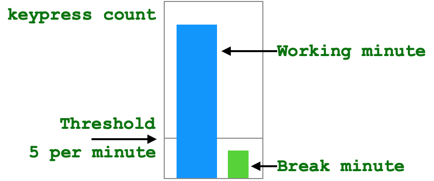
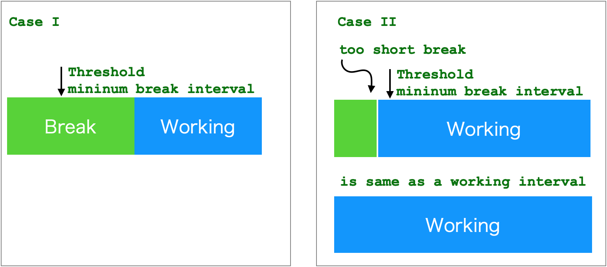
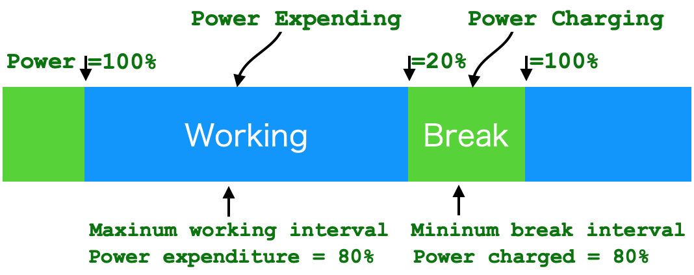
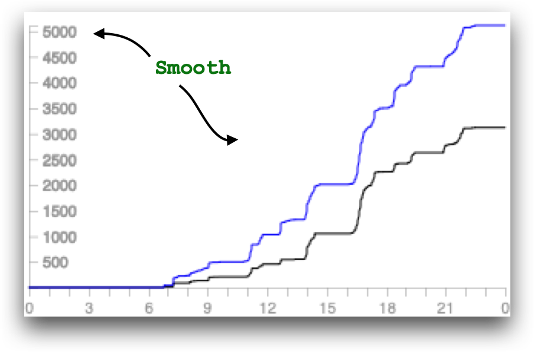

.. _h7a6941666312412f5d33487d7c4f3d7:

User Guide
##########

.. _h24263c4b755f1b4e49342c321267514d:

Synopsis
********

.. _h1f7e585de5397451c6b6391b7a0:

Terminology
***********

.. _h373c2b1564c323c6d545e4952435b25:

Working Minute and Break Minute
===============================

\ |IMG1|\ 

The Typing Counter takes a minute as a working minute or a break minute by a threshold value (default to 5 keypresses).  For a minute with keypress count over the threshold value, it is a working minute. Otherwise it is a break minute.

.. _h372630646e56301561a1a371134181b:

Break Interval
==============

\ |IMG2|\ 

The Typing Counter takes continuous break minutes as a break interval only if its length is more than a threshold value (default to 10 minutes). If its length is less than the threshold value, it is also taken as a working interval. This is for encouraging you to take enough break time.

.. _h7d27c1759465b14283e39615c302058:

Overworking Interval
====================

\ |IMG3|\ 

The Typing Counter checks length of every continuous working interval. If its length is more than a threshold value (default to 50 minutes), it takes those exceeding time as overworking interval. 

.. _h286272113e3f7c2f29363693b2f42:

Power Calculation
=================

\ |IMG4|\ 

Human body is like a battery. It looses power during working interval and restores power back by taking break. The body power of the Typing Counter is a score from 0% to 100%. At day beginning, power is set to 100%. Power is reduced as long as working. Power is restored in break intervals. There is an expenditure value (defaults to 80%) associates with the mininum working interval (defaults to 50 minutes), which defines the reducing rate (50 minutes of working spent 80% power) 

\ |IMG5|\ 

The default reducing rate is 1.6% per working minute. If you are overworking, the power score would reduce to zero after 12.5 minutes.

\ |IMG6|\ 

The default charging rate is 8% per break minute. If you take a break, the power score would be restored to 100% after 10 minutes.

.. _h7015777b347a33c5e481931d625040:

Tabs
****

.. _h431d5061723751203410681c45363038:

Stress
======

This is a diagram of keypress count by left and right fingers.

\ |IMG7|\ 

This diagram reads:

At 13:43, your left fingers has pressed keyboard for 6,568 times.  And your right fingers has pressed keyboard for 8,469 times.

--------

\ |IMG8|\ 

This diagram reads:

In number of 6,568 keypress by your left fingers, litter finger(L5) counts 853, ring finger(L4) counts 1,725, middle finger(L3) counts 2,125, forefinger counts 1,864 and thumb(L1) counts 0. 

In number of 8,496 keypress by your right fingers, thumb(R1) counts 1,420, forefinger(R2) counts 3,193, middle finger(R3) counts 794, ring finger(R4) counts 1,091 and little finger(R5) counts 1,998.

From 0:00 till 13:43,your left middle finger and right forefinger are mostly hard-working fingers.

.. _h2c1d74277104e41780968148427e:

You can read more information from this kind of diagram. For example: A casual day would be like this below. It has smooth lines.

\ |IMG9|\ 

But for this diagram below:

.. _h73207a20436b676b595165b4e243d46:

\ |IMG10|\ ===========

This reads that you start typing on your computer around AM8:00, and you are very hard working, almost without any break till 12:00. Maybe you are in an unusually emergent state or you have to adjust working-behavior for better health.

.. _h67588282f612229e44437f7063305:

Balance
=======

This tab shows your balance of working and break. 

\ |IMG11|\ 

This diagram reads:  from 7:25 to 21:41, you spent 7 hours and 20 minutes for working, 6 hours and 56 minutes for break. In all of working time, 38% (aka 2 hours and 49 minutes is overworking).

Below the chart, a color bar shows break/working/overworking tempo. Green section is break interval, blue section is working interval and deep blue section is  overworking interval.

.. _h234f20346f3f70460477d1f5d2e7b22:

Power
=====

Human body is like a battery. It looses power during working and restores power back with break. 

.. bottom of content

.. |IMG5| image:: static/User_Guide_5.png
   :height: 173 px
   :width: 609 px

.. |IMG6| image:: static/User_Guide_6.png
   :height: 186 px
   :width: 605 px

.. |IMG7| image:: static/User_Guide_7.png
   :height: 264 px
   :width: 377 px

.. |IMG8| image:: static/User_Guide_8.png
   :height: 294 px
   :width: 341 px

.. |IMG11| image:: static/User_Guide_11.png
   :height: 326 px
   :width: 396 px
