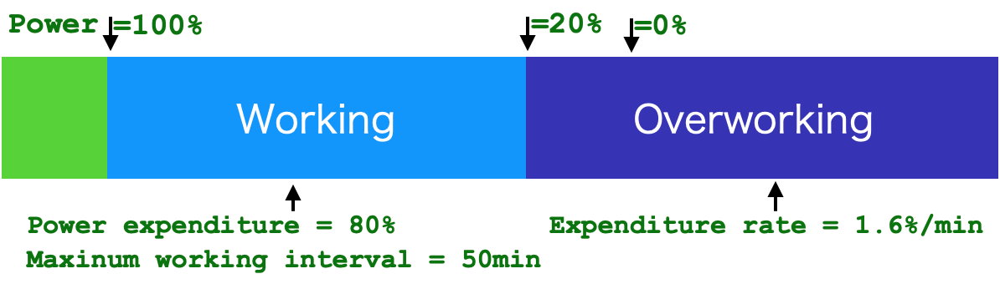
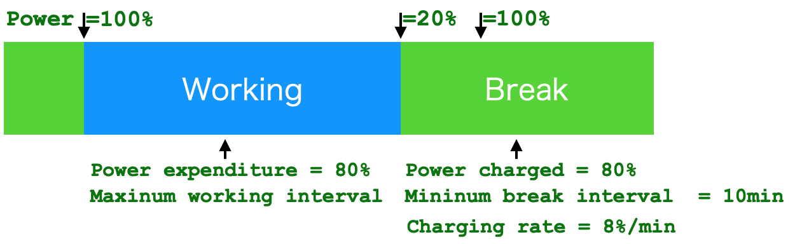
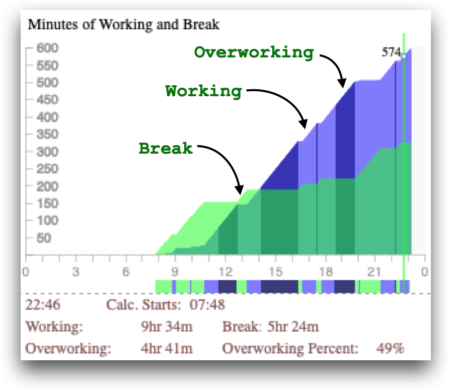
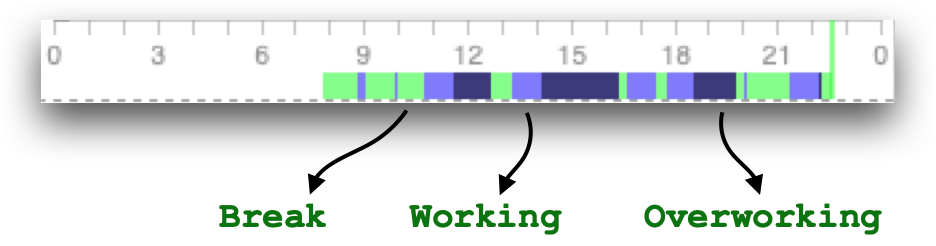

.. _h7a6941666312412f5d33487d7c4f3d7:

User Guide
##########

.. _h24263c4b755f1b4e49342c321267514d:

Synopsis
********

.. _h1f7e585de5397451c6b6391b7a0:

Terminology
***********

.. _h373c2b1564c323c6d545e4952435b25:

Working Minute and Break Minute
===============================

\ |IMG1|\ 

The Typing Counter takes a minute as a working minute or a break minute by a threshold value (default to 5 keystrokes).  For a minute with keystrokes count over the threshold value, it is a working minute. Otherwise it is a break minute.

.. _h372630646e56301561a1a371134181b:

Break Interval
==============

\ |IMG2|\ 

A working interval is a continuous chunk of working minutes. But the Typing Counter recognizes a continuous chunk of break minutes as a break interval only if its length is more than a threshold value (default to 10 minutes). If its length is less than the threshold value. The Typing Counter takes it as a working interval. This is for encouraging you to have enough time for a break.

.. _h7d27c1759465b14283e39615c302058:

Overworking Interval
====================

\ |IMG3|\ 

The Typing Counter checks length of every continuous working interval. If its length is longer than a threshold value (default to 50 minutes), The Typing Counter takes those exceeding minutes as an overworking interval. 

.. _h286272113e3f7c2f29363693b2f42:

Power Calculation
=================

\ |IMG4|\ 

Human body is like a battery. It looses power during working interval and restores power back by taking breaks. The Typing Counter considers your body power as a score from 0% to 100%. At day beginning, your power is set to 100%. Alone with you are working, your power has reduced. You have to take breaks for restoring power. There is an expenditure value (defaults to 80%) associates with the maximum working interval (defaults to 50 minutes), which also implies the reducing rate (1.6% per working minute) as well as the charging rate (8% per break minute).

\ |IMG5|\ 

By the default reducing rate. Your power score would become zero after overworking for 12.5 minutes.

\ |IMG6|\ 

The power lose in a maximum working interval would be totally recovered after a minimum break interval. That is to say, if you work for 50 minutes and take a break for 10 minutes, your power score would be 100% again. The charging rate is 8% per break minute under default values.

.. _h7015777b347a33c5e481931d625040:

Tabs
****

.. _h431d5061723751203410681c45363038:

Stress
======

This is a diagram of keypress count by left and right fingers.

\ |IMG7|\ 

This diagram reads:

At 13:43, your left fingers has pressed keyboard for 6,568 times.  And your right fingers has pressed keyboard for 8,469 times.

--------

\ |IMG8|\ 

This diagram reads:

In number of 6,568 keypress by your left fingers, litter finger(L5) counts 853, ring finger(L4) counts 1,725, middle finger(L3) counts 2,125, forefinger counts 1,864 and thumb(L1) counts 0. 

In number of 8,496 keypress by your right fingers, thumb(R1) counts 1,420, forefinger(R2) counts 3,193, middle finger(R3) counts 794, ring finger(R4) counts 1,091 and little finger(R5) counts 1,998.

From 0:00 to 13:43, your left middle finger and right forefinger are mostly hard-working fingers.

.. _h2c1d74277104e41780968148427e:

You can read more information from this kind of diagram. For example: A casual day would be like this below. It has smooth lines.

\ |IMG9|\ 

But for this diagram below:

.. _h73207a20436b676b595165b4e243d46:

\ |IMG10|\ ===========

This reads that you start typing on your computer around AM8:00, and you are very hard working, almost without any break till 12:00. Maybe you are in an unusually emergent state or you have to adjust working-behavior for better health.

.. _h67588282f612229e44437f7063305:

Balance
=======

This tab shows your balance of working and break. 

\ |IMG11|\ 

This diagram reads:  from 7:48 to 22:46, you spent 9 hours and 34 minutes for working, 5 hours and 24 minutes for break. In all of working time, 49% (aka 4 hours and 41 minutes) is overworking. It's not good.

Below the chart, a color bar shows break/working/overworking tempo. Green section is break interval, blue section is working interval and dark blue section is  overworking interval.

\ |IMG12|\ 

At the lower part is a percentage comparison of working and break interval in total, aka "9hr 34m" vs. "5hr 24m". This diagram shows that you spent 64% for working and 36% for breaks from 07:48 to 22:46.

\ |IMG13|\ 

.. _h234f20346f3f70460477d1f5d2e7b22:

Power
=====

.. _h175e5034f3d2b2d704737456d2e7562:

Data Format
***********

.. _h1f544f2c4950c11396e127c3e292e3b:

Simple Format
=============

For every raw of a single file. Below is meaning for every column

+------+---------------------------------------------------------------------------------------------------------------------------------+
|Column|Meaning                                                                                                                          |
+------+---------------------------------------------------------------------------------------------------------------------------------+
|0     |Timestamp                                                                                                                        |
+------+---------------------------------------------------------------------------------------------------------------------------------+
|1     |counts of unset (ignored) keys.                                                                                                  |
+------+---------------------------------------------------------------------------------------------------------------------------------+
|2     |counts of left hand little finger (L5)                                                                                           |
+------+---------------------------------------------------------------------------------------------------------------------------------+
|3     |counts of left hand ring finger (L4)                                                                                             |
+------+---------------------------------------------------------------------------------------------------------------------------------+
|4     |counts of left hand middle finger (L3)                                                                                           |
+------+---------------------------------------------------------------------------------------------------------------------------------+
|5     |counts of left hand index finger / forefinger (L2)                                                                               |
+------+---------------------------------------------------------------------------------------------------------------------------------+
|6     |counts of left hand thumb (L1)                                                                                                   |
+------+---------------------------------------------------------------------------------------------------------------------------------+
|7     |counts of right hand thumb (R1)                                                                                                  |
+------+---------------------------------------------------------------------------------------------------------------------------------+
|8     |counts of right hand index finger / forefinger (R2)                                                                              |
+------+---------------------------------------------------------------------------------------------------------------------------------+
|9     |counts of right hand middle finger (R3)                                                                                          |
+------+---------------------------------------------------------------------------------------------------------------------------------+
|10    |counts of right hand ring finger (R4)                                                                                            |
+------+---------------------------------------------------------------------------------------------------------------------------------+
|11    |counts of right hand little finger (R5)                                                                                          |
+------+---------------------------------------------------------------------------------------------------------------------------------+
|12    |duration of unset keys (L5)                                                                                                      |
+------+---------------------------------------------------------------------------------------------------------------------------------+
|13    |duration of left hand little finger (L5)                                                                                         |
+------+---------------------------------------------------------------------------------------------------------------------------------+
|14    |duration of left hand ring finger (L4)                                                                                           |
+------+---------------------------------------------------------------------------------------------------------------------------------+
|15    |duration of left hand middle finger (L3)                                                                                         |
+------+---------------------------------------------------------------------------------------------------------------------------------+
|16    |duration of left hand index finger / forefinger (L2)                                                                             |
+------+---------------------------------------------------------------------------------------------------------------------------------+
|17    |duration of left hand thumb (L1)                                                                                                 |
+------+---------------------------------------------------------------------------------------------------------------------------------+
|18    |duration of right hand thumb (R1)                                                                                                |
+------+---------------------------------------------------------------------------------------------------------------------------------+
|19    |duration of right hand index finger / forefinger (R2)                                                                            |
+------+---------------------------------------------------------------------------------------------------------------------------------+
|20    |duration of right hand middle finger (R3)                                                                                        |
+------+---------------------------------------------------------------------------------------------------------------------------------+
|21    |duration of right hand ring finger (R4)                                                                                          |
+------+---------------------------------------------------------------------------------------------------------------------------------+
|22    |duration of right hand little finger (R5)                                                                                        |
+------+---------------------------------------------------------------------------------------------------------------------------------+
|23    |counts of left mouse button                                                                                                      |
+------+---------------------------------------------------------------------------------------------------------------------------------+
|24    |counts of middle mouse button                                                                                                    |
+------+---------------------------------------------------------------------------------------------------------------------------------+
|25    |counts of right mouse button                                                                                                     |
+------+---------------------------------------------------------------------------------------------------------------------------------+
|26    |counts of composite keys (shift, control,...)                                                                                    |
+------+---------------------------------------------------------------------------------------------------------------------------------+
|27    |counts of hand moving from keyboard to mouse. (beliving this is very close to the counts of hand moving from mouse to keyboard). |
+------+---------------------------------------------------------------------------------------------------------------------------------+

Remarks:

#. "Empty String" value is 0.

#. If both "left mouse click" and "right mouse click" are mapping to "unset" . The field 27 is always 0.

.. _h7d4c3277791e387f322d4d676f136037:

Academic Format
===============

This format adds extra 14 fields for researches on Keystroke Dynamic.

\ |IMG14|\ 

+--+------------------------------------------------------------------------------+
|28|Arithematic mean of  PP                                                       |
+--+------------------------------------------------------------------------------+
|29|Arithematic mean of  PR                                                       |
+--+------------------------------------------------------------------------------+
|30|Arithematic mean of  RP                                                       |
+--+------------------------------------------------------------------------------+
|31|Arithematic mean of  RR                                                       |
+--+------------------------------------------------------------------------------+
|32|Geometric mean of PP                                                          |
+--+------------------------------------------------------------------------------+
|33|Geometric mean of  PR                                                         |
+--+------------------------------------------------------------------------------+
|34|Geometric mean of  RP                                                         |
+--+------------------------------------------------------------------------------+
|35|Geometric mean of  RR                                                         |
+--+------------------------------------------------------------------------------+
|36|Harmonic mean of  PR                                                          |
+--+------------------------------------------------------------------------------+
|37|Harmonic mean of  PR                                                          |
+--+------------------------------------------------------------------------------+
|38|Harmonic mean of  RP                                                          |
+--+------------------------------------------------------------------------------+
|39|Harmonic mean of  RR                                                          |
+--+------------------------------------------------------------------------------+
|40|Sample size of PP, the number for calculating mean of PP (RP, RR are the same)|
+--+------------------------------------------------------------------------------+
|41|Sample size of PR, the number for calculating mean of PR                      |
+--+------------------------------------------------------------------------------+

Remarks:

#. Field 28-39 are calculated by the same kind of keystrokes in a minute.

#. Special keys (mostly are composite keys), such as Shft, Control, Caplock, Command, Option/Alt are excluded from statistics.

#. Mouse clicks are excluded, too.

.. bottom of content

.. |IMG1| image:: static/User_Guide_1.png
   :height: 174 px
   :width: 420 px

.. |IMG2| image:: static/User_Guide_2.png
   :height: 182 px
   :width: 569 px

.. |IMG3| image:: static/User_Guide_3.png
   :height: 112 px
   :width: 520 px

.. |IMG4| image:: static/User_Guide_4.png
   :height: 226 px
   :width: 572 px

.. |IMG7| image:: static/User_Guide_7.png
   :height: 264 px
   :width: 377 px

.. |IMG9| image:: static/User_Guide_9.png
   :height: 282 px
   :width: 428 px

.. |IMG10| image:: static/User_Guide_10.png
   :height: 284 px
   :width: 424 px

